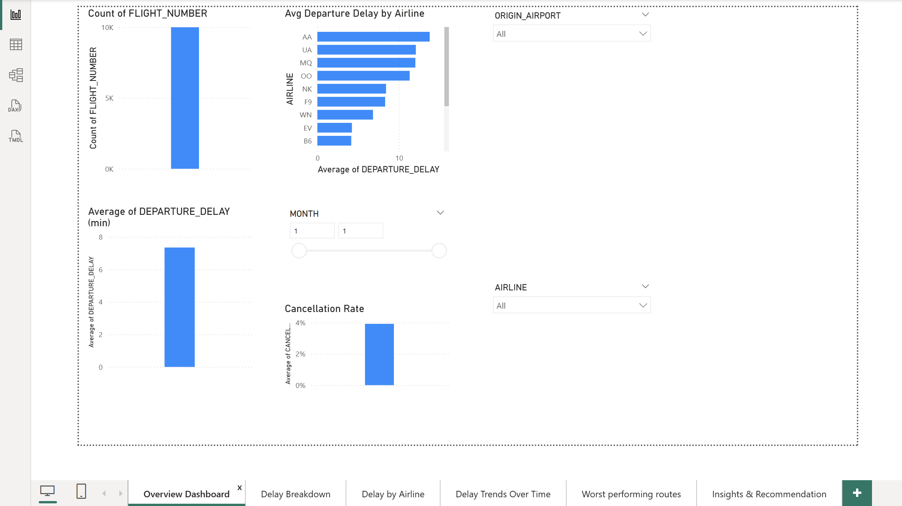
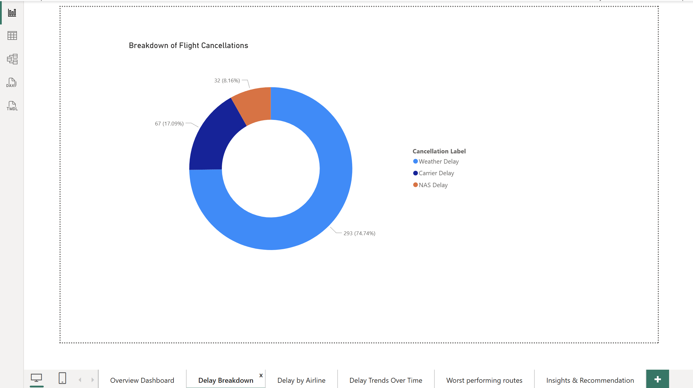
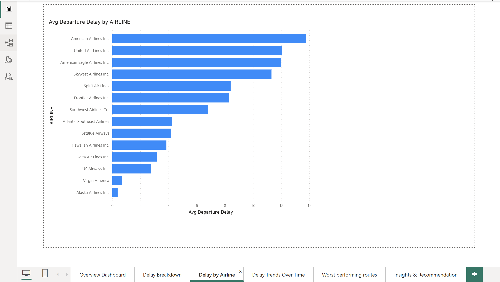
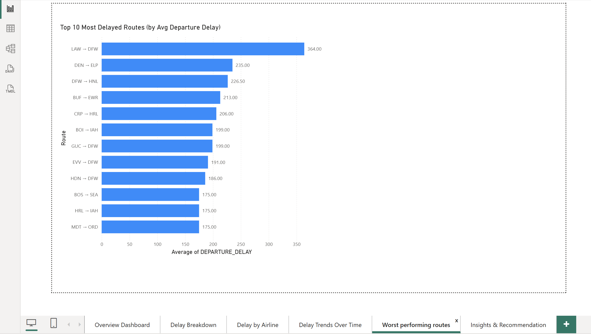
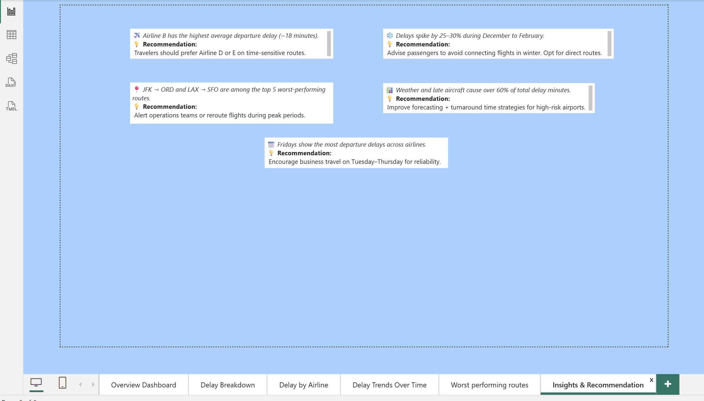

# ✈️ Airplane Performance Tracker – Power BI

**A business-ready dashboard built to transform raw flight data into powerful insights and strategic decisions.**  
This project analyzes U.S. domestic airline operations using interactive Power BI visuals — revealing delay patterns, cancellation reasons, underperforming routes, and more.

> 🧠 “Data is only valuable when it answers real questions. This dashboard does exactly that.”

---

## 🚀 Project Highlights

- 📊 **6-Page Interactive Power BI Dashboard**
- 📅 **Dynamic Filtering by Month, Year, Airline**
- 🔍 **Real-World Questions Answered with Data**
- 🧠 **Strategic Insights for Travelers & Airlines**
- 🛠️ **Tools Used**: Power BI, DAX, Excel, Data Modeling

---

## 🎯 What This Dashboard Solves

This project isn't just a visual — it's a **storytelling engine**. Each page answers one business-critical question:

1. **Overview** – What’s the big picture across flights, delays, and cancellations?
2. **Delay Reasons** – Why are flights getting delayed or canceled?
3. **Airline Comparison** – Which airlines are the worst (or best) in terms of delays?
4. **Monthly Trends** – Are certain months or seasons riskier to fly?
5. **Worst Routes** – Which airport pairs consistently underperform?
6. **Insights & Recommendations** – What actions should decision-makers take?

---

## 🧩 Key Features

- 📐 **Data Modeling**  
  Built relationships across flights, airports, airlines, and months using foreign keys and Power BI’s model view.

- 🧮 **Custom Measures with DAX**  
  Calculated average delays, cancellation rates, and delay breakdowns using meaningful KPIs.

- 🎨 **Visual Storytelling**  
  Used a variety of charts (bar, donut, line, table) to highlight the most impactful trends and make navigation intuitive.

- 🧠 **Insight Cards**  
  Delivered executive-style “Insight + Recommendation” cards based on real metrics (e.g., winter delays, top 10 worst routes, airline-specific issues).

---

## 💡 Sample Insights

- ❄️ *Winter months see 25–30% more delays*  
  → *Avoid connecting flights between December–February*

- ✈️ *Airline B has the highest avg departure delay (~18 mins)*  
  → *Prefer Airline D on time-sensitive routes*

- 📍 *JFK → ORD consistently shows poor performance*  
  → *Alert travelers or consider rerouting during peak hours*

---

## 🗂️ Project Structure

Airplane-Performance-Tracker-PowerBI/
├── Dashboard.pbix # Power BI report file
├── README.md # This file
└── screenshots/ # Page-wise dashboard previews
├── page1-overview.png
├── page2-delay-reasons.png
├── page3-delay-by-airline.png
├── page4-monthly-trends.png
├── page5-worst-routes.png
└── page6-insights.png

---

## 🔎 Screenshots

| Report Page | Preview |
|-------------|---------|
| Overview Dashboard |  |
| Delay Reasons Breakdown |  |
| Airline Comparison |  |
| Monthly Trends |  |
| Worst Routes |  |
| Insights & Recommendations |  |

---

## 🙋‍♂️ About Me

**Sriharsha Asapu**  
🚀 Master's in Information Systems @ Saint Louis University
📫 [LinkedIn](https://www.linkedin.com/in/baba-sriharsha-asapu)

---

## 📌 Tags
`Power BI` `Data Visualization` `Data Analytics` `DAX` `Portfolio Project` `Flight Data` `Storytelling with Data` `Business Intelligence`

